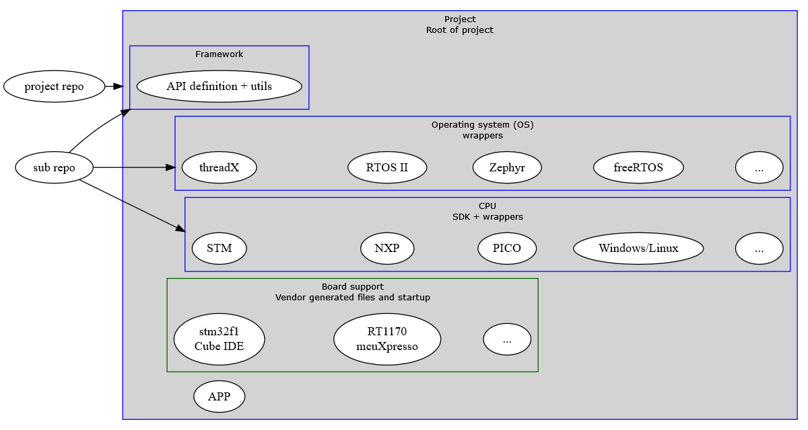
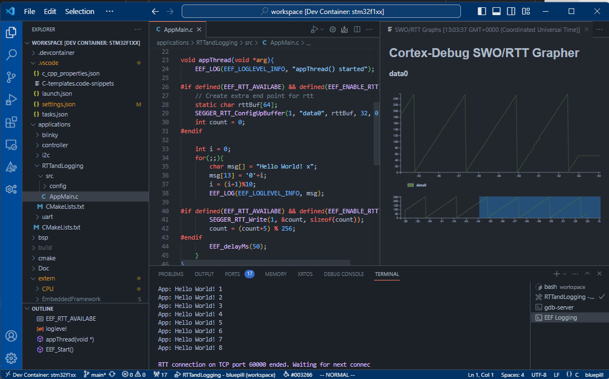

<!-- _class: lead -->
# EEF - Engineero Embedded Framework
#### One framework to rule them all

---


---
<!-- _class: lead -->
# EEF - Engineero Embedded Framework
#### One framework to ~~rule~~ wrap them all

---
# What is EEF, the Engineero Embedded Framework?
* C framework for embedded applications with abstracted vendor HAL's and (RT)OS functions
* Simply build an application for a wide range of MCU's and OS'es
  * Currently supported are stm32f1, stm32f2, NXP's RT1170 and RP2040
  * Currently only FreeRTOS support

---
# Why EEF?
* Internal project to keep us happy
* No fully hardware independent framework
  * Ignore the other frameworks like CMSIS for a second here 😜
* Unified build system
  * Everything in CMake
* With devcontainer support: IDE independent
  * You should love VSCode though

---
```C
void appThread(void *arg){
    for(;;){
        EEF_gpioSetDigital(LED, 1);
        EEF_delayMs(500);
        EEF_gpioSetDigital(LED, 0);
        EEF_delayMs(100);
    }
}

void EEF_Start(){
    EEF_threadInitialize();

    int appThreadID;
    EEF_threadCreate("app", appThread, NULL, 256, 1, &appThreadID);
}
```

---
# Difficulties faced and overcome
* Vendor provided libraries ≠ buildsystem independent
* Unified API with different underlying vendor HAL's
  * API broad enough but not too broad
* General project organisation with vendor SDK's with different needs

---
# General setup
* Repo for general utilities and API for OS/CPU
* Repo per OS with wrapper implementations for the OS API
* Repo per CPU with wrapper implementations for the CPU API
  * May contain vendor delivered SDK with HAL
* Main project contains BSP's with startup and configuration files
  * Vendor tool generated
  * Mapping between EEF and vendor SDK

---


---
<!-- _class: lead -->
# Give it a go at
[Github](https://github.com/engineero-nl/EmbeddedFramework_ExampleProjects)

---
# Give it a go
* Clone examples repo (on WSL)
* Open in VSCode and enter STM32F1xx devcontainer
* Play around with blinky and RTTandLogging
  * RTTandLogging -> example for VSCode + devcontainers

---
