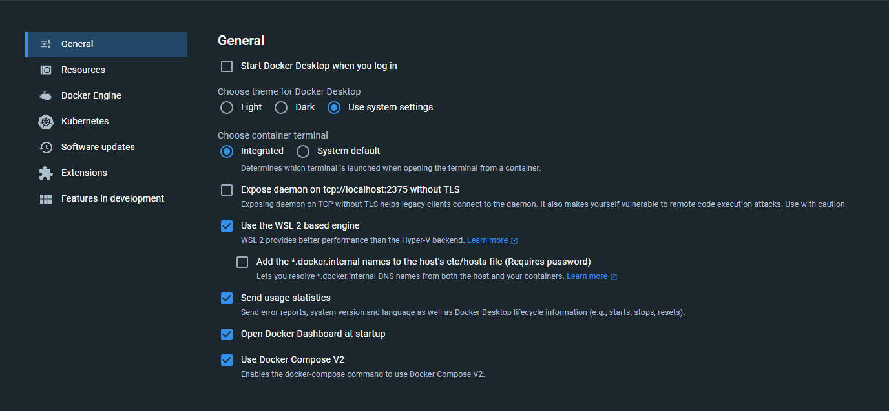
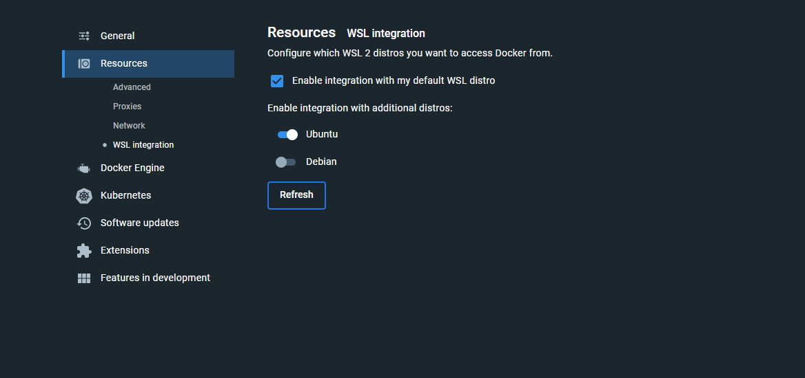

# Embedded developing and debugging in devcontainers

## Prerequisites
For this tech event (and using devcontainers with embedded development in 
general) one needs to have certain things installed on their device. This 
section describes the process of getting things up and running

### Windows
From here on it is assumed 
[wsl2](https://learn.microsoft.com/en-us/windows/wsl/),
[visual studio code](https://code.visualstudio.com/) and 
[docker desktop](https://www.docker.com/products/docker-desktop/) are installed.

#### Setup distro in WSL2
(note: if one already has a working wsl2 setup with a distro (here it is assumed
to be debian based but others are fine as well of course) up and running skip
this step)

In the windows command prompt do the following
```batch
C:\Users\JoppeBlondel>wsl --list --online
The following is a list of valid distributions that can be installed.
Install using 'wsl.exe --install <Distro>'.

NAME                                   FRIENDLY NAME
Ubuntu                                 Ubuntu
Debian                                 Debian GNU/Linux
kali-linux                             Kali Linux Rolling
Ubuntu-18.04                           Ubuntu 18.04 LTS
Ubuntu-20.04                           Ubuntu 20.04 LTS
Ubuntu-22.04                           Ubuntu 22.04 LTS
OracleLinux_7_9                        Oracle Linux 7.9
OracleLinux_8_7                        Oracle Linux 8.7
OracleLinux_9_1                        Oracle Linux 9.1
openSUSE-Leap-15.5                     openSUSE Leap 15.5
SUSE-Linux-Enterprise-Server-15-SP4    SUSE Linux Enterprise Server 15 SP4
SUSE-Linux-Enterprise-15-SP5           SUSE Linux Enterprise 15 SP5
openSUSE-Tumbleweed                    openSUSE Tumbleweed
```
Lets install Ubuntu here:
```batch
C:\Users\JoppeBlondel>wsl --install Ubuntu
Ubuntu is already installed.
Launching Ubuntu...
Installing, this may take a few minutes...
Please create a default UNIX user account. The username does not need to match your Windows username.
For more information visit: https://aka.ms/wslusers
Enter new UNIX username: joppe
New password: ********
Retype new password: ********
passwd: password updated successfully
Installation successful!
To run a command as administrator (user "root"), use "sudo <command>".
See "man sudo_root" for details.

Welcome to Ubuntu 22.04.2 LTS (GNU/Linux 5.15.90.1-microsoft-standard-WSL2 x86_64)

 * Documentation:  https://help.ubuntu.com
 * Management:     https://landscape.canonical.com
 * Support:        https://ubuntu.com/advantage


This message is shown once a day. To disable it please create the
/home/joppe/.hushlogin file
joppe@Probook-i7:~$
```
It will ask for a (UNIX) username and a password and after installation it leaves
you in the ubuntu terminal.


#### Docker desktop and WSL2
For things to work smoothly and to have a bit more control over the environment
docker is running in we must make sure docker is setup to use the just created
distro in wsl.

Open docker desktop en under settings (the cog icon in the right upper corner):


And make sure the `Use the WSL 2 based engine` option is ticked:


To make sure the just created Ubuntu distro is used as backend it must be 
enabled under `Resources->WSL integration` (and don't forget to click on
`Apply & restart`)


#### USB passthrough from windows to WSL2
The distro's in WSL2 are running in their own sandbox and cannot touch the USB
devices directly. Fortunately there is USB-IP which shares USB devices over IP.
Microsoft themselves has a good 
[tutorial](https://learn.microsoft.com/en-us/windows/wsl/connect-usb) on how to
install and use it. After installation the sharing will work as follow (from the
windows command promt in *administrator mode*):
```batch
C:\Users\JoppeBlondel>usbipd wsl list
BUSID  VID:PID    DEVICE                                                        STATE
2-1    047f:c056  Plantronics Blackwire 3220 Series, USB Input Device           Not attached
2-2    04f2:b6bf  HP HD Camera, HP IR Camera                                    Not attached
2-7    04f3:0c5e  ELAN WBF Fingerprint Sensor                                   Not attached
2-10   8087:0026  Intel(R) Wireless Bluetooth(R)                                Not attached
3-2    17e9:6015  ThinkPad Hybrid USB-C with USB-A Dock, Lenovo USB Audio       Not attached
3-3    17ef:a359  Lenovo USB Ethernet                                           Not attached
6-1    046d:c093  Logitech USB Input Device, USB Input Device                   Not attached
6-3    045e:082c  USB Input Device                                              Not attached
6-4    0483:3748  STM32 STLink                                                  Not attached
7-1    17ef:a354  Billboard Device, USB Input Device                            Not attached

C:\Users\JoppeBlondel>usbipd wsl attach -b 6-4 -d Ubuntu
```
(note: one may omit the `-d Ubuntu` if the specified distro is the default one)

### Linux
TODO