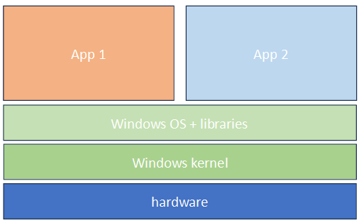
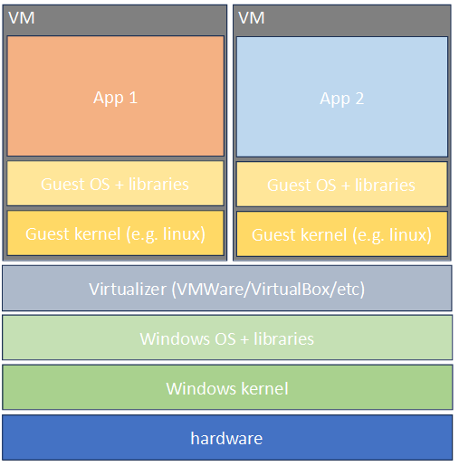
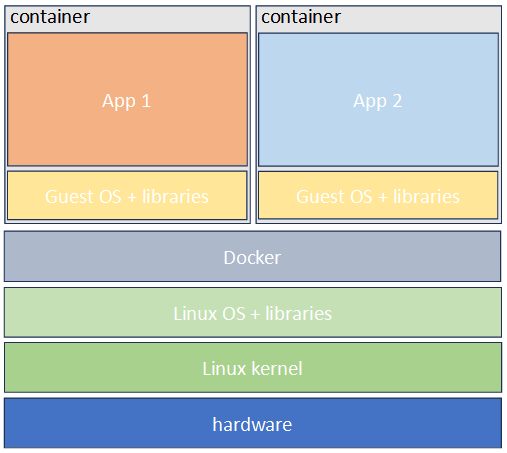
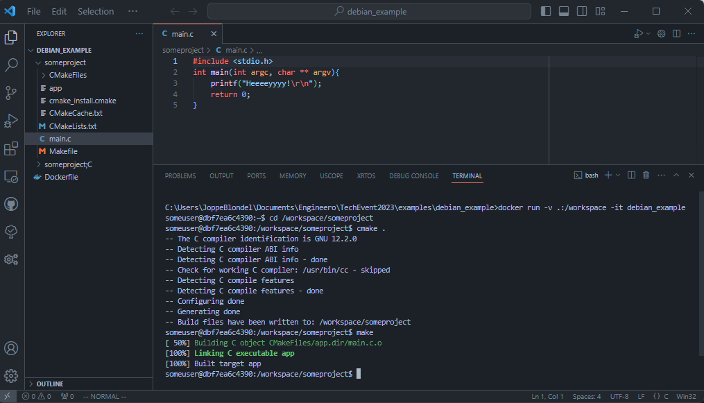
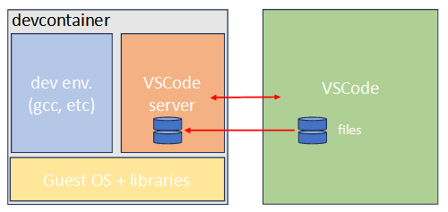
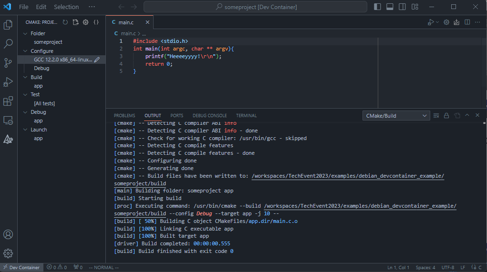
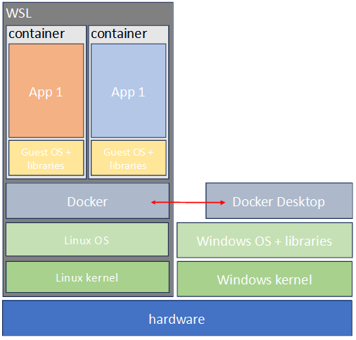
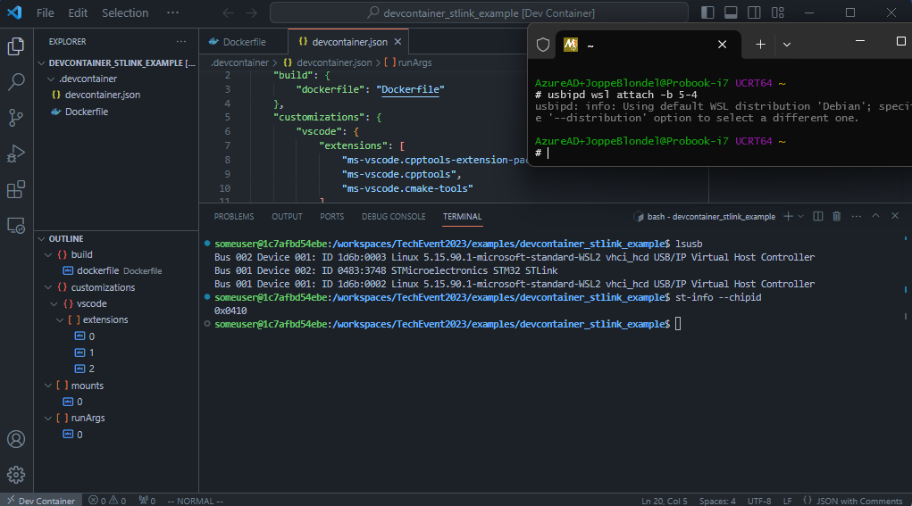

<!-- _class: lead -->
# Devcontainers and Embedded software development
#### Down the rabbit hole to never come back

---
# What's the problem?
* All dev's need to install the tools
    * CubeIDE, MCUXpresso, MPLab, E2studio, SEGGER embedded...
    * arm-gcc v8/v9/v10, xc16...
    * other GNU tools: make, binutils, libraries, libc...
* 10 versions of gcc, Eclipse and other things installed
* Every time a new IDE to learn and customize

---
# Can we solve it?
* Just install and configure the lot
    <!-- Thats a lot of work but native support. Different for each environment -->
* Remote development (e.g. over ssh)
    <!-- That works well for things like web development but with embedded real-time 
    debugging becomes harder -->
* Combine all tools, libraries and the lot in one package
    * VM
        <!-- Quite the resource hog -->
    * Snap/Flatpack/AppImage
        <!-- snap: ubuntu only -->
        <!-- AppImage: lack of udates -->
        <!-- All on linux only and more for 1 application -->
    * (Docker) container
        <!-- Lightweight like above and has native windows (with wsl) support, but best with: -->
    * Devcontainer with IDE supporting them

---
# So... devcontainers... what are they?
[containers.dev](https://containers.dev/): *A development container (or dev container for short) allows you to use a **container** as a full-featured development environment. It can be used to run an application, to separate tools, libraries, or runtimes needed for working with a codebase, and to aid in continuous integration and testing. ...*

---
# Down the rabbit hole: containers
*... you to use a **container** as a full-featured ...*
* Sandbox environment
* Like a VM: full OS
* Lightweight: uses kernel of the host
* Declarative: Infrastructure as Code
* Integration with lots of tools

---
# Down the rabbit hole: containers
They are used for:
* Easy deployment of (web) applications
* Micro-services on a (kubernetes) cluster
* Packaging of software and dependencies
    * running software locally
    * packaged software for use in CI/CD

---
# Like a VM and lightweight
Applications on top of OS


---
# Like a VM and lightweight
Applications in VM's


---
# Like a VM and lightweight
Applications in Docker containers

[Alpine](https://www.alpinelinux.org/about/): *... A container requires no more than **8 MB** ...*


---
### Declarative: Infrastructure as Code
```Dockerfile
FROM debian
ENV DEBIAN_FRONTEND=noninteractive

RUN apt update -y && apt install -y \
    build-essential \
    cmake

RUN useradd -ms /bin/bash someuser
WORKDIR /home/someuser
USER someuser

CMD /bin/bash
```

---
# Declarative: Infrastructure as Code
* To create a container image: 
    `docker build --tag 'debian_example' .`
* To run a container image: 
    `docker run -it 'debian_example'`
* This will get you a Debian shell
    ```bash
    $ docker run -it debian_example
    someuser@e9bf5806d588:~$ pwd
    /home/someuser
    someuser@e9bf5806d588:~$
    ```

---
# Containers and Docker

<!-- Docker released and published in 2013 -->
<!-- 2015 startd the OCI (open container initiative): not just docker anymore: podman/containerd/lxd -->

---


---
# Devcontainers: containers with spice


---
# Devcontainers: containers with spice
* Full development environment
* Utilities and personalization
* Configuration of IDE

---
# Devcontainers and VSCode


---


---
# Devcontainers: an example
```json
{
    "build": { "dockerfile" : "Dockerfile" },
    "customizations": {
        "vscode": {
            "extensions" : [
                "ms-vscode.cpptools-extension-pack",
                "ms-vscode.cpptools",
                "ms-vscode.cmake-tools",
            ]
        }
    }
}
```

---
# Devcontainers and VSCode
* Seamless: functions as local instance
* Executes build tools, debugger and other tools from container
* VSCode Configuration and plugins declared in the json file
* Make sure to install the Dev Containers plugin `ms-vscode-remote.remote-containers`

---
# The full story? Nope...
We develop firmware, not normal applications or web-apps

---
# The full story? Nope...
We develop firmware, not normal applications or web-apps

... So I lied?

---
# Embedded development
* Debugging of non-native applications
* Use of physical debugger (e.g. JLink/STLink/BMP)
* **we need USB**
    * so just pass the USB to the container?
    * ..........

---
# Docker on Windows
Docker is in it's core a linux tool

* Containers themselves on WSL
* USB to WSL: USBIP
    * see readme


---


---
# All together
* Toolchain, debugging tools and IDE configurations packaged together
* Declarative
* Lightweight
* Multi-purpose: development and CI/CD