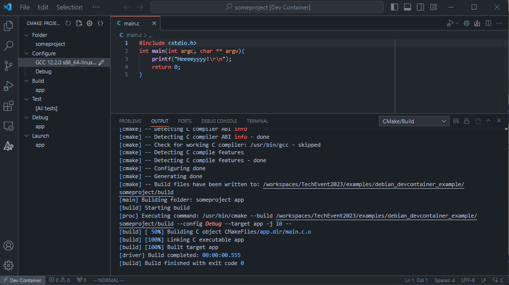
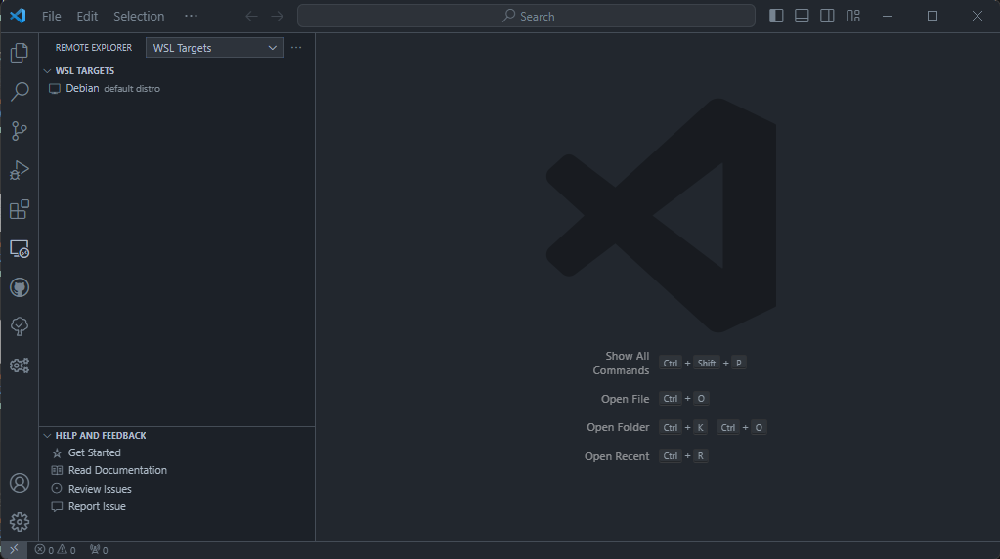

<!-- _class: lead -->
# Devcontainers and Embedded software development
#### How-to and some notes

---
# What's the goal?
* VSCode
* Simple hello-world application in C
* Easy building from IDE
* Integrated debugging of application
* Running in devcontainer

---


---


---
# What do we need
* Definition of Docker container
* Definition of the devcontainer
* Simple buildsystem
* VSCode configuration for building and debugging

---
### A small note

* Containers run on WSL
* Files on Windows must be shared to WSL: slow...
* Fix: Work from WSL

---
## Work from WSL: Create project location


---
## Work from WSL: Create project location


---
## Work from WSL: Create project location


---
## Work from WSL: Create project location


---
## Work from WSL: Create project location


---
## Work from WSL: Create project location
Or clone a repo in WSL
```bash
AzureAD+JoppeBlondel@Probook-i7 UCRT64 ~
$ wsl
joppe@Probook-i7:/mnt/c/msys64/home/JoppeBlondel$ cd
joppe@Probook-i7:~$ git clone http://somerepohere.git
```

---
## Work from WSL: Open project in WSL


---


---


---


---
# OK we're in... and now?
* `.devcontainer` directory with
  * `devcontainer.json` -> Definition of the devcontainer to use
  * `Dockerfile` -> Definition of the underlying Docker container

---
# `.devcontainer/devcontainer.json`
minimal setup:
```json
{
    // Give the devcontainer a name, optional
    "name": "TechEvent2023_A",
    // Use a docker container and point to the Dockerfile
    "build": {
        "dockerfile": "Dockerfile"
    }
}
```

---
# `.devcontainer/Dockerfile`
minimal setup with gcc and cmake:
```Dockerfile
# Base image: Microsoft's debian image
FROM mcr.microsoft.com/vscode/devcontainers/base:debian
# Things are ran from a script, apt needs this to run in scripts
ENV DEBIAN_FRONTEND=noninteractive
# Install needed software
RUN apt update -y && apt install -y build-essential cmake gdb
```
[Microsofts images](https://hub.docker.com/_/microsoft-devcontainers-base): Alpine, Ubuntu and Debian
<div style="font-size:70%"><i>
... Beyond git, this image / Dockerfile includes zsh, Oh My Zsh!, a non-root vscode user with sudo access, and a set of common dependencies for development.
</i></div>

---


---


---
# Lets add a hello world
```C
// main.c
#include <stdio.h>
int main(int argc, char ** argv){
    printf("Hello World!\r\n");
    return 0;
}
```
```cmake
# CMakeLists.txt
cmake_minimum_required(VERSION 3.10)
project(hello_world LANGUAGES C)
add_executable(app main.c)
```

---
# VSCode: plugins for everything
* With cmake installed we can build from the terminal but...
* `CMake Tools` plugin for VSCode for easy CMake build and debug functionality
* `C/C++` and `C/C++ Extension Pack` plugins for VSCode for C/C++ autocomplete

---
# Add them to the devcontainer
add the following to `devcontainer.json`:
```json
"customizations": {
    "vscode": {
        "extensions": [
            "ms-vscode.cpptools",
            "ms-vscode.cpptools-extension-pack",
            "ms-vscode.cmake-tools"
        ]
    }
}
```
---


---


---
# This is not embedded yet right?
* Just linux gcc
* Native executable debugging
* Things we miss
  * USB
  * USB <-> C debugging
  * C Debugger which is embedded aware
  * Maybe some nice embedded specific features in VSCode

---
# USB
See [readme](https://github.com/JoppeBlondel/TechEvent2023) in TechEvent repo
*note: When using Ubuntu as WSL distro udev is already running*

---
# USB <-> C debugging
* Piece of software connecting to the physical debugger
* Implementing a GDB server which can set breakpoints, single step, etc
* Examples:
  * **openocd**
  * pyocd
  * black magic probe
  * (j)linkserver

---
# C Debugger which is embedded aware
* arm-none-eabi-gdb
* riscv-gdb
* ....

All depricated now and combined to
**gdb-multiarch**

---
# Nice embedded specific features
* cortex-debug (`marus25.cortex-debug`)
* device packages (`marus25.cortex-debug-dp-xxxx`)
* Peripheral Viewer (`mcu-debug.peripheral-viewer`)
* MemoryView (`mcu-debug.memory-view`)
* Embedded Tools (`ms-vscode.vscode-embedded-tools`)
* Task Explorer (`spmeesseman.vscode-taskexplorer`)

---


---
